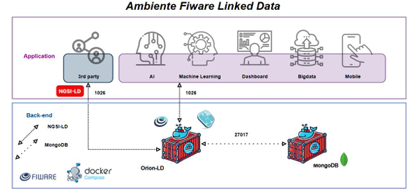
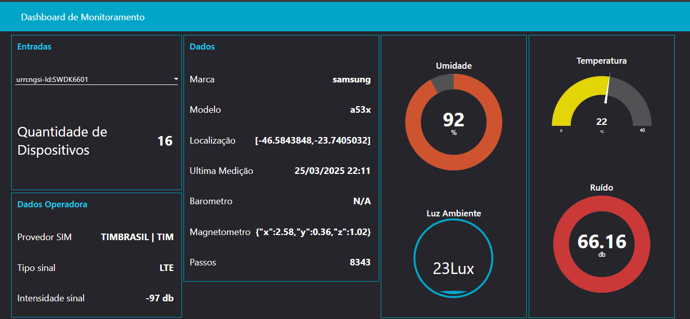
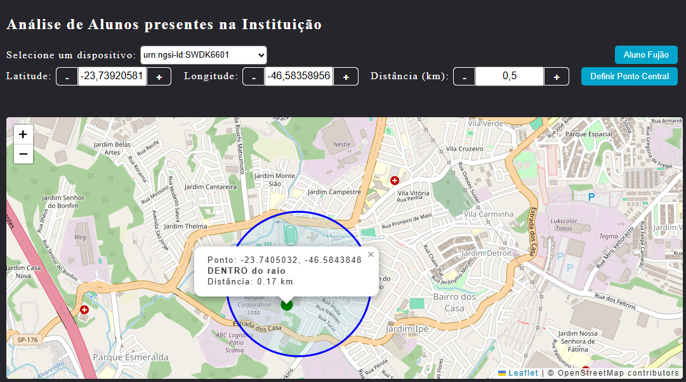
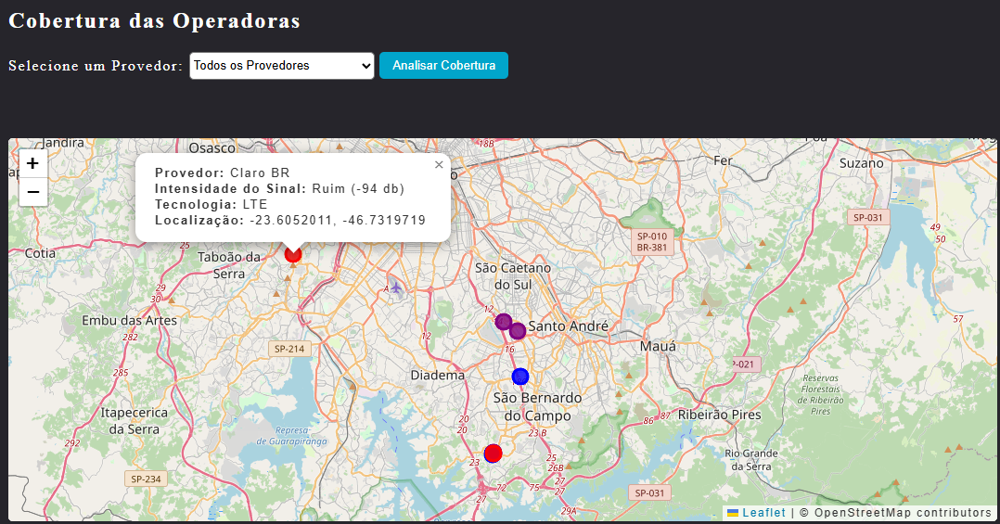

# FIWARE-LD: Plataforma de Gestão de Dados Contextuais com NGSI-LD

Este repositório contém uma implementação do FIWARE Orion-LD, utilizando a especificação **NGSI-LD** para gestão de dados contextuais em tempo real. Ele permite a orquestração de serviços essenciais com Docker e **docker-compose**, integrando o **Orion-LD**, **MongoDB** e **Node-RED** para armazenamento de dados contextuais.

## Recursos incluídos:

- **Orion-LD**: Broker de Contexto compatível com NGSI-LD, permitindo a gestão e a consulta de entidades baseadas em contexto.
- **MongoDB (v4.0)**: Base de dados para armazenamento de dados contextuais.
- **Node-RED**: Ferramenta para criação de fluxos de automação e integração com IoT.
- **WebApp**: Serviço baseado em `nginx` para servir arquivos estáticos e configurações personalizadas.
- Configuração de **docker-compose** para facilitar a orquestração e o gerenciamento dos containers.
- Exposição do broker Orion-LD na porta **1027**, com MongoDB configurado para armazenamento persistente e Node-RED acessível na porta **1880**.

Este repositório é ideal para quem deseja explorar a criação e o gerenciamento de dados contextuais no formato NGSI-LD e integrar com sistemas IoT ou aplicações baseadas em FIWARE.

## Portas dos Serviços

- **1026/TCP** - Orion-LD (Porta interna do Context Broker)
- **27017/TCP** - MongoDB (Porta do banco de dados, recomenda-se não abrir para a internet)
- **1880/TCP** - Node-RED (Interface web para criação de fluxos IoT)
- **8080/TCP** - WebApp (Serviço para servir arquivos estáticos via `nginx`)

## Configuração do WebApp

O serviço `webapp` utiliza a imagem oficial do `nginx` para servir arquivos estáticos e configurações personalizadas. O diretório `webapp` contém os arquivos HTML, CSS e JS, além de um arquivo `nginx.conf` para configurar o comportamento do servidor.

### 🌐 Proxy Reverso com NGINX

O serviço `webapp` utiliza o NGINX para:

- Servir a interface estática (HTML, JS, etc.).
- Redirecionar chamadas para o Orion-LD via `/orion-api/`, com suporte a CORS.

### Exemplo de chamada para o broker via proxy:

```plaintext
http://localhost:8080/orion-api/ngsi-ld/v1/entities
```
## 📬 Collection do Postman (Material para experimentação)

Aqui você encontrará um conjunto de collections desenvolvidas para serem importadas na ferramenta **Postman**, facilitando a interação com os componentes do **FIWARE** e o modelo de dados **NGSI-LD**.

### 🔗 Collection oficial da FIWARE Foundation
A **FIWARE Foundation** disponibiliza uma collection pública com exemplos completos de uso do Orion-LD e conceitos de Linked Data:

👉 [Acessar collection oficial no Postman](https://www.postman.com/fiware/fiware-foundation-ev-s-public-workspace/folder/gthdx5a/linked-data-using-orion-ld)

### 📁 Collection do Projeto (Experiência prática)
Esta collection foi criada especialmente para este projeto e contém chamadas reais utilizadas nos testes e validações da solução. Inclui exemplos de:

- Criação de entidades do tipo `Building` para representar instituições de ensino.
- Criação e consulta de entidades do tipo `Device`.
- Estabelecimento de relacionamentos entre entidades com base no modelo NGSI-LD.

👉 [Download da Collection FIWARE (JSON)](./resources/fiware-collection.json)

### 💡 Como importar no Postman

1. Abra o Postman.
2. Vá em **File > Import**.
3. Selecione o arquivo `.json` salvo localmente.
4. Pronto! Agora você pode executar os endpoints e explorar as interações com a API Orion-LD.


# Comparativo entre FIWARE NGSIv2 e FIWARE NGSI-LD

| Característica                       |            FIWARE NGSIv2             |          FIWARE NGSI-LD           |
|--------------------------------------|--------------------------------------|-----------------------------------|
| **Modelo de Dados**                  | JSON/Key-Value                       | JSON-LD (baseado em Linked Data)  |
| **Padrão de Interface**              | NGSIv2 (REST API)                   | NGSI-LD (W3C RDF, JSON-LD)        |
| **Suporte a Dados Contextuais**      | Atributos de entidades sem semântica forte | Atributos semânticos com suporte a Linked Data e ontologias |
| **Relacionamento entre Entidades**   | Relacionamentos limitados e implícitos | Relacionamentos explícitos e semânticos |
| **Interoperabilidade**               | Baseado em APIs específicas de FIWARE | Baseado em padrões abertos e interoperáveis como W3C Linked Data |
| **Gerenciamento de Tempo**           | Suporte limitado a timestamps em entidades | Suporte nativo a dados temporais e históricos |
| **Persistência de Dados**            | Depende de extensões como Cygnus para persistência de dados históricos | Dados históricos podem ser gerenciados diretamente com NGSI-LD e integrações apropriadas |
| **Escalabilidade**                   | Arquitetura mais simples, mas com limitações de escalabilidade em grandes cenários | Mais adequada para sistemas distribuídos e cenários de IoT em larga escala |
| **Ontologias e Semântica**          | Não tem suporte direto a ontologias  | Integração com ontologias e vocabulários externos (por exemplo, schema.org) |
| **Formato de Respostas**             | JSON                                 | JSON-LD com links para vocabulários externos |
| **Ciclo de Vida das Entidades**      | Simples (CRUD: Create, Read, Update, Delete) | Rico (CRUD + patch, relacionamento entre entidades, notificações semânticas) |
| **Compatibilidade com NGSIv2**       | NGSIv2 é amplamente utilizado, mas com menor suporte semântico | NGSI-LD oferece compatibilidade via transcodificadores, mas a migração completa requer ajustes no modelo de dados |

## Arquitetura do FIWARE-LD



## Como usar:

1. Clone o repositório:
   ```sh
   git clone https://github.com/MichellSeidl/fiware-ld.git
   cd seu-repositorio
   ```
2. Suba os containers com Docker Compose:
   ```sh
   docker-compose up -d
   ```
3. Acesse os serviços:
   - **Orion-LD**: `http://localhost:1026`
   - **Node-RED**: `http://localhost:1880`

## Observações Importantes para o Node-RED

Ao acessar o **Node-RED** pela primeira vez (`http://localhost:1880`):

1. Clique no menu lateral direito e selecione **Gerenciador de Paleta**.
2. Procure e instale o pacote **node-red-dashboard** (conforme ilustrado na imagem abaixo):

   

3. Ainda no menu lateral, clique em **Importar** e selecione o arquivo de fluxo do dashboard localizado em 
 [Download do Dashboard(JSON)](./resources/fluxo-node_red.json.json)
 
Assim, você terá acesso ao dashboard de monitoramento pronto para uso.

## Links de Produção

Experiencia 1:
http://20.206.200.173:1880/ui/

Experiencia 2 e 3 
http://20.206.200.173:8080/


## 🎓 Experimentos do Projeto de TCC

Este repositório também inclui experimentos desenvolvidos como parte de um Trabalho de Conclusão de Curso (TCC), focados em aplicações práticas da plataforma **FIWARE-LD** para monitoramento em tempo real e análise de dados contextuais com uso de sensores embarcados em dispositivos móveis.

---

### 📊 Dashboard de Monitoramento

**Objetivo:** Oferecer uma interface amigável para visualização e análise dos dados coletados.

**Componentes:**
### 📡 Sensores e Dados Coletados

Os dispositivos utilizados nos experimentos foram configurados para coletar os seguintes dados:

- **Device ID**
- **Marca**
- **Modelo**
- **Localização GPS**
- **Última Medição**
- **Provedor SIM**
- **Tipo de Sinal**
- **Intensidade de Sinal**
- **Barômetro**
- **Magnetômetro (x, y, z)**
- **Contador de Passos**
- **Nível de Ruído**
- **Umidade**
- **Temperatura**
- **Luz Ambiente**

**Ferramentas:**
- **Node-RED** para exibição dos dados coletados dos dispositivos móveis



---

### 🧭 Experimento “Aluno Fujão”

**Objetivo:** Detectar saídas não autorizadas de estudantes de áreas delimitadas (ex: faculdade).

**Descrição:**
- Cada dispositivo reporta sua localização ao Orion-LD periodicamente
- Verificação se o ponto está dentro de um **raio geográfico definido**
- Se um aluno sair do raio, um alerta é gerado

**Tecnologias:**
- **FIWARE Orion-LD** para ingestão de dados
- **MongoDB** para armazenamento
- **Leaflet** para visualização do mapa em tempo real



---

### 🔍 Análise de Provedores de Telefonia

**Objetivo:** Mapear a intensidade de sinal de operadoras (Vivo, Claro, TIM) usando crowdsourcing.

**Descrição:**
- Coleta de dados realizada por dispositivos móveis com sensores de:
  - Intensidade de sinal
  - Localização (GPS)
  - Tipo de rede (4G, 5G, LTE)
  
- Dados enviados ao **Orion-LD** 
- Persistência em **MongoDB** 
- Visualização com **Leaflet**

**Resultados:**
- Mapas interativos com a cobertura de sinal por operadora
- Identificação de áreas de baixa cobertura



---

Essas experiências demonstram o potencial da plataforma **FIWARE-LD** para aplicações inteligentes, especialmente em contextos de **cidades inteligentes**, **educação conectada** e **monitoramento de infraestrutura urbana**.